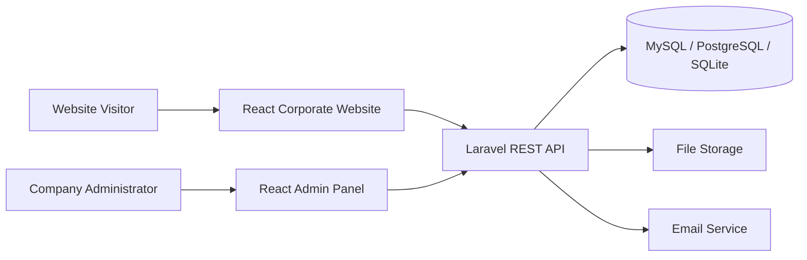

# 1. Project Overview

## Project name

MAHAPRABHU TECH INNOVATION PRIVATE LIMITED Corporate Website and Admin Panel.

## Goal

Create a professional digital identity for the company, present services and products, generate business enquiries, publish careers and news, and allow authorised staff to update major website content from an admin panel.

## Architecture

## Recommended production stack

- Backend: Laravel 13 and PHP 8.3+
- Frontend: React 19 with Vite
- Authentication: Laravel Sanctum API tokens
- Database: MySQL or PostgreSQL
- Server: Ubuntu VPS with Nginx and PHP-FPM
- SSL/CDN: Cloudflare or equivalent

## Main users

Public visitors, customers, government and institutional representatives, job applicants, editors, sales users, HR users and super administrators.
