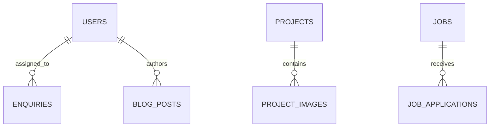

# 3. Database Design

## Main tables

| Table | Purpose |
|---|---|
| `users` | Admin accounts and roles |
| `services` | Company services |
| `projects` | Products and portfolio projects |
| `project_images` | Project gallery |
| `team_members` | Public team profiles |
| `jobs` | Career vacancies |
| `job_applications` | Candidate submissions |
| `blog_posts` | News and articles |
| `testimonials` | Client feedback |
| `enquiries` | Contact and sales enquiries |
| `quotations` | Quotation requests |
| `site_settings` | Website configuration |

## Rules

- Slugs are unique.
- Public content requires an active/published state.
- Files are stored on disk; only relative paths are stored in the database.
- Enquiries and applications should normally be retained for reporting.
