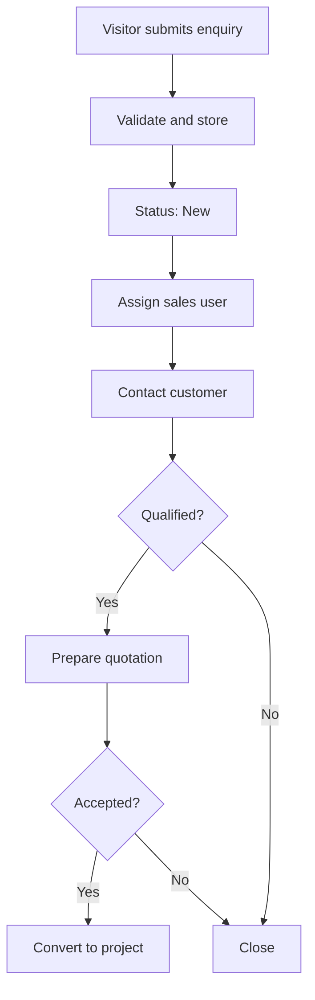

# 5. Workflows

## Enquiry workflow

## Content workflow

Admin login → select module → add/edit content → upload media → preview → publish → React website shows updated content.

## Recruitment workflow

Vacancy published → candidate applies → HR reviews → shortlisted/interview/selected/rejected → record retained.

## Quotation workflow

Customer submits requirement → sales review → technical estimate → proposal → accepted/rejected/under discussion → accepted opportunity becomes a project.
